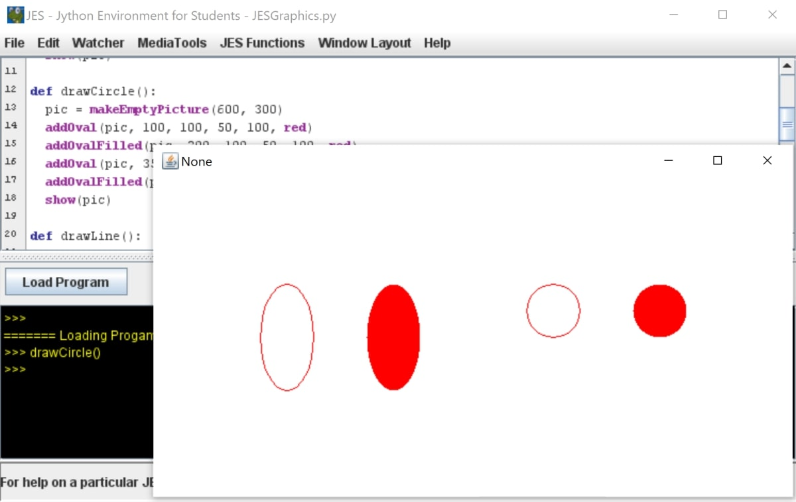

# JES-Shapes-and-Graphics
This is an example JES program that draws different shapes on an empty picture

* How to Create an Empty Canvas in JES
* How to Create and Add Rectangles
* How to Create and Add Circles
* How to Create and Add Lines

## Prerequisites 

* Make sure you have JES installed on your computer.

## To Run

* Open the JES Program.
* Click on File > open program and choose JESGraphicsTest/JESGraphicsTest.py
* Load the program
* Run the functions using the command line

## Example

